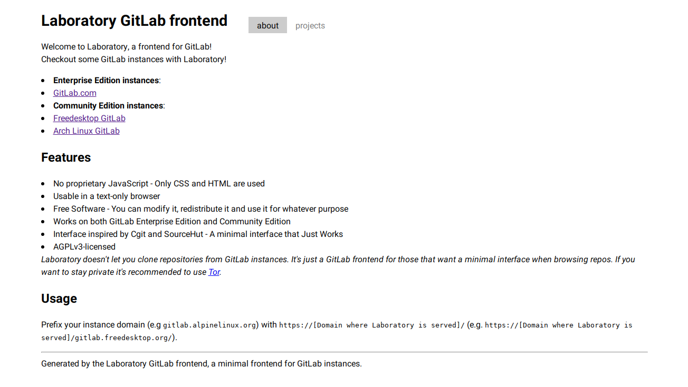
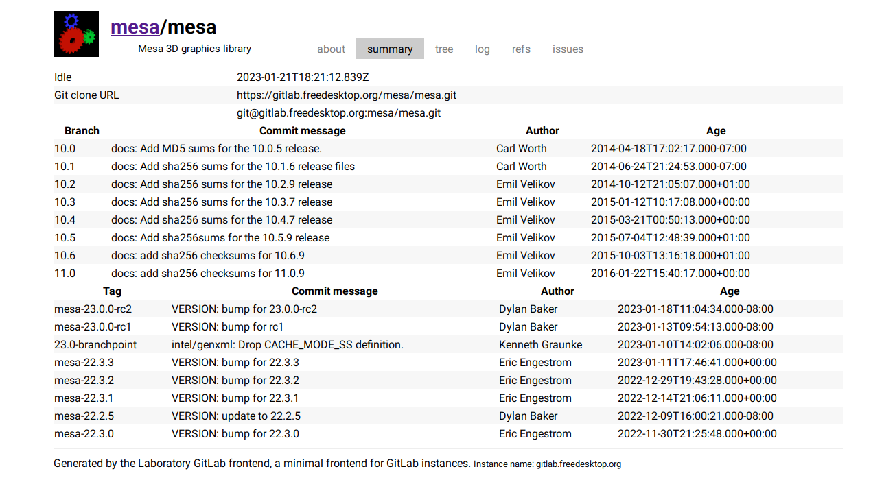

# Laboratory

*A Simple GitLab frontend.*

## How does it work?

Laboratory uses GitLab's REST API to fetch data about users/groups and 
repositories (those so-called 'projects').

Then it parses that data and shows it in a JS-free lightweight webpage 
inspired by [Cgit](https://git.zx2c4.org/) and [SourceHut](https://sr.ht/).

## Dependencies

* `pycmarkgfm`
* `requests`
* `flask` and all its dependencies

## Features

### Basic

* List projects for any instance
* List group projects
* List group subgroups

### Repositories

* Issues (no comments though)
* Wikis
* Tree
* Show a commit
* Log
* Partial README rendering
* Refs
* Description
* Idle
* Avatar

### Groups

* Subgroups
* Repositories
* Avatar

### Users

* Avatar
* State

Unfourtunately, accessing more data about users requires authentication, 
so don't expect Laboratory to fetch more than that unless GitLab changes 
that.

## TODO

* Implement Merge Requests (currently all API calls to MRs must be 
  authenticated)
* Implement Logging in (possibly just a matter of getting the token key and 
  using it for all requests, plus some other features like creating repos)
* Group wikis
* Proper support for project wikis that aren't really repositories
* And more

## Known Issues

* When searching for a repository in GitLab.com, the API returns an internal 
  server error. This is GitLab.com's problem, not ours.
* Laboratory is very sensitive about URLs
* Laboratory currently cannot render RST-formatted README files
* Laboratory freaks out when a blob is not a "normal" file (e.g. an image)

## Instances

| URL | Author | Note |
|-----|--------|------|
| https://lab.vern.cc | ~vern team | Has alternate subdomains. |
| https://laboratory.vitali64.duckdns.org | Ferass | Uses a [patch](https://git.vitali64.duckdns.org/misc/laboratory.vitali64.duckdns.org.git) applied on-top. Also used as a testing ground. |

## Screenshots

These screenshots may be outdated.

Main page</img>

Browsing Group repositories</img>

Browsing a repository</img>
