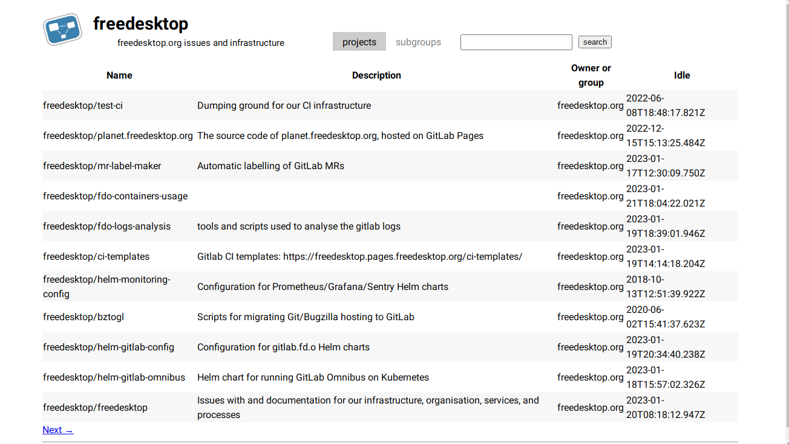

# Laboratory

*A Simple GitLab frontend.*

## How does it work?

Laboratory uses GitLab's REST API to fetch data about users/groups and 
repositories (those so-called 'projects').

Then it parses that data and shows it in a JS-free lightweight webpage 
inspired by [Cgit](https://git.zx2c4.org/) and [SourceHut](https://sr.ht/).

## TODO

* Implement Merge Requests (currently all API call to MRs must be 
  authenticated)
* Implement Logging in (possibly just a matter of getting the token key and 
  using it for all requests, plus some other features like creating repos)
* Implement Wikis support
* And more

## Known Issues

* When searching for a repository in GitLab.com, the API returns an internal 
  server error. This is GitLab.com's problem, not ours.
* Laboratory is very sensitive about URLs
* Laboratory currently cannot render RST-formatted README files

## Screenshots

<table>
<tr>
<td>

</td>
</tr>
<tr>
<td>

</tr>
<tr>
<td>

</td>
</tr>
</table>
